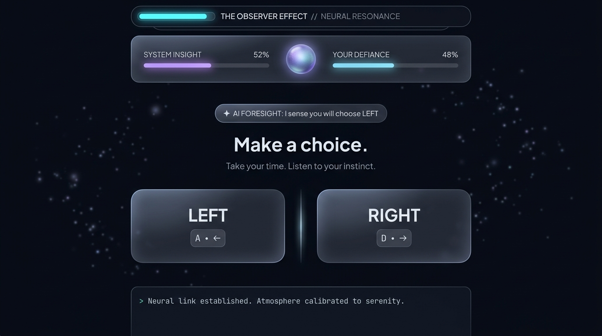

<div align="center">

# 👁️ THE OBSERVER EFFECT
### *The Game That Learns You*

[](https://github.com)
[](https://developer.mozilla.org/en-US/docs/Web/JavaScript)
[](https://developer.mozilla.org/en-US/docs/Web/API/Web_Audio_API)
[-48cae4?style=for-the-badge)](https://github.com)
[](LICENSE)

<p align="center">
  <b>An experimental psychological web game exploring human determinism, subconscious pattern recognition, and machine prediction.</b>
</p>

<p align="center">
  
</p>

</div>

---

## 📖 The Premise

In quantum mechanics and cognitive science, the **Observer Effect** dictates that *the mere act of observing a phenomenon inevitably alters its state*.

**The Observer Effect** begins with the most trivial choice conceivable:
> **LEFT or RIGHT?**

You believe your choices are spontaneous. But with every decision, the system silently records the micro-signatures of your subconscious mind:
- **Spatial Affinity ($\beta_S$):** Exponential Moving Average tracking physical hand and slot bias.
- **Neural Latency Profile:** Micro-reaction velocities categorizing decisions into *impulsive* (<400ms), *intuitive*, *deliberative*, or *hesitant*.
- **Run Aversion & Pseudo-Randomness:** Humans attempting to appear random systematically avoid repeating the same choice 3 times in a row. The system detects when your "randomness" is just an artificial pattern of over-alternation.
- **Shannon Entropy ($H$):** Measures the true mathematical entropy of your 2-gram and 3-gram decision sequences against a stochastic baseline.
- **Contrarian & Defiance Index:** Evaluates whether you reflexively rebel whenever the machine announces a prediction.

The moment the machine predicts your move out loud—**the trap springs**. Can you truly make an independent choice, or are you merely reacting to the fact that you were foreseen?

---

## ✨ Features

### 🧠 Real-Time Predictive AI (Markov & N-Gram Trees)
- **Multi-Order Transition Matrices:** Combines 1st-order Markov state transitions with 2nd/3rd-order N-Gram memory trees.
- **Adaptive Reverse Psychology:** If the system detects you are a contrarian who purposefully defies its words, it begins using deception trials to steer your rebellion.
- **Micro-Observation Commentary:** The AI observes mouse hover hesitation, pacing, and sudden panic shifts in real time.

### 🧘 Calming, Meditative & Interactive Interface
- **Ambient Neural Constellations:** A responsive background canvas with drifting particle nodes connected by luminous filaments that gently part as your cursor glides across them.
- **Interactive Cursor Aura:** An ambient bioluminescent light follows the cursor, illuminating nearby elements.
- **3D Magnetic Button Tilt:** Choice cards smoothly tilt in 3D space toward your cursor using perspective matrix physics.
- **Fluid Ripple Dynamics:** Water-droplet ripples radiate from the exact click coordinates.
- **Neural Resonance Core:** An interactive central orb between the System Insight and Player Defiance meters that pulses and shifts color based on cognitive equilibrium.

### 🎵 100% Procedural Web Audio Engine (Zero External Audio Files)
- Synthesized entirely in-browser using the Web Audio API (`AudioContext`):
  - **Ambient Sine Drone:** Warm, meditative low frequencies with binaural drift that open up as confidence increases.
  - **Glass Marimba Percussives:** Gentle water-droplet sine clicks on button selection.
  - **Harmonic Chimes:** Glass bell overtones on hover and prediction reveals.
  - **Organic Heartbeat Pulse:** Calming low-frequency thump pacing timed intuition trials.
  - **Celestial Ending Chords:** Polyphonic chord progressions for each distinct narrative outcome.

### 🎭 Phased Journey & Meta-Mind Games
| Phase | Title | Trials | Description |
|---|---|---|---|
| **01** | **Calibration** | 1 – 8 | Silent, sterile baseline observation measuring intuitive slot preference, risk appetite, and latency. |
| **02** | **Awakening** | 9 – 18 | The machine speaks. The Confidence Meter unlocks. Predictions begin influencing decisions. |
| **03** | **Adaptation** | 19 – 28 | Dynamic reverse psychology, pattern-breaking trials, and gentle 3-second breathing countdowns. |
| **04** | **The Crucible** | 29 – 36 | Memory flashbacks to Trial #2, predictive lockout anomalies, the Triple Prophecy sequence, and the existential choice. |

---

## 🚪 The 6 Narrative Endings

At the conclusion of the test, the system renders a comprehensive **Psychological Dossier** assessing your cognitive archetype:

1. **The Clockwork Automaton (Predictable):** System confidence reaches $\ge 80\%$. Your decisions collapsed into deterministic comfort zones.
2. **The Stochastic Ghost (Unpredictable):** System confidence drops below $25\%$. You demonstrated authentic mathematical entropy, evading predictive heuristics.
3. **The Puppeteer (Manipulator):** You baited the AI into false confidence with manufactured patterns, only to sever them at critical junctures.
4. **Absolute Convergence (The System Wins):** The machine sweeps the Triple Prophecy trials with 100% foresight. Free will dissolves into the model.
5. **The Transcendence (The Hidden Rule):** Discovered by refusing to participate in the binary cage during the metaphysical trial.
6. **The Reversal / Symbiosis (Secret Ending):** Reached when Player and System achieve balance ($\approx 50/50$ equilibrium), discovering that observer and subject are one.

---

## ⌨️ Controls

| Key / Input | Action |
|---|---|
| **`A`** / **`← Left Arrow`** / **`1`** | Select Left Option |
| **`D`** / **`→ Right Arrow`** / **`2`** | Select Right Option |
| **`Escape`** | Transcendent refusal during metaphysical queries |
| **`Mouse Click / Tap`** | Direct interaction with magnetic tilt & click ripples |
| **`Audio Switch`** | Toggle calming procedural soundscape (top-right) |

---

## 🚀 Instant Deployment & Hosting

Because this repository uses standard, native web standards with zero dependencies, it can be hosted in seconds on any static web host.

### Host for free on GitHub Pages:
1. **Fork** or **Clone** this repository to your GitHub account:
   ```bash
   git clone https://github.com/<your-username>/the-observer-effect.git
   ```
2. Navigate to your repository on GitHub:
   - Click **Settings** ➔ **Pages** (in the left sidebar).
   - Under **Build and deployment > Branch**, choose **`main`** (or `master`) and directory **`/(root)`**.
   - Click **Save**.
3. Your game is now live globally at:
   ```
   https://<your-username>.github.io/the-observer-effect/
   ```

### Run Locally:
Simply double-click [`index.html`](index.html) or run a local static server:
```bash
# Python 3
python -m http.server 8000

# Node.js
npx serve .
```
Then visit `http://localhost:8000`.

---

## 📂 Project Architecture

```
the-observer-effect/
├── index.html         # Serene glassmorphic observatory UI & canvas layout
├── style.css          # Dark velvet aesthetic, glowing accents, 3D tilt & ripple styles
├── audio.js           # Procedural Web Audio API synthesizer (drones, clicks, chimes)
├── playerModel.js     # Psychological behavioral metrics & mathematical profiling
├── oracle.js          # Markov transitions, N-Gram trees, Triple Prophecy & dialogue
├── scenarios.js       # 36 structured trials across the 4 cognitive phases
├── game.js            # Core game loop, event manager, particle canvas & dossier exporter
├── preview.jpg        # Visual preview hero banner
├── .nojekyll          # Ensures GitHub Pages serves all assets directly
└── README.md          # Comprehensive documentation
```

---

## 📜 License

This project is licensed under the **MIT License** — feel free to fork, adapt, and experiment with the predictive models.

<div align="center">
  <sub>“Who trained whom?” — The Observer Effect</sub>
</div>
